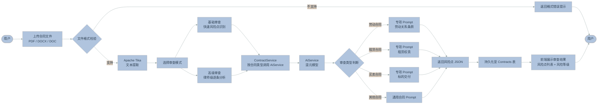
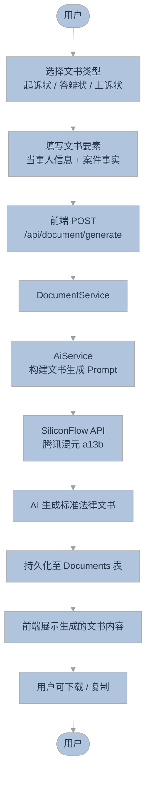
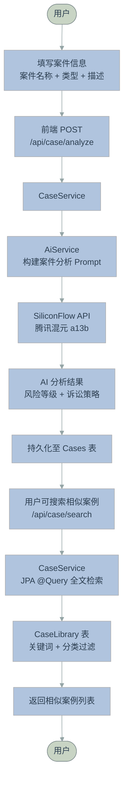

# LexAI 智慧法律智能体平台

## 1. 项目概述

LexAI 是一款面向法律领域的智能辅助平台，基于大语言模型技术，为用户提供法律咨询、案件分析、合同审查、法律文书生成以及合同协议模板检索等一站式法律 AI 服务。

平台采用前后端分离架构，后端基于 Spring Boot 3.2 构建，前端基于 Vue 3 构建，通过 JWT 实现身份认证与 API 安全访问。AI 能力接入腾讯混元大模型（hunyuan-a13b-instruct），由后端 `AiService` 统一调度。

### 1.1 主要功能

| 功能模块 | 描述 |
|---------|------|
| 法律智能咨询 | AI 问答，支持婚姻家庭、合同纠纷、劳动争议等多个法律分类 |
| 案件分析 | 用户提交案件描述，AI 自动分析案件类型、诉讼策略与风险点 |
| 合同审查 | 上传合同文件，基础审查（快速风险点识别）或高级审查（律师级逐条分析） |
| 法律文书生成 | AI 生成起诉状、答辩状、上诉状等标准法律文书 |
| 合同协议模板库 | 本地文件系统全文检索，支持关键词搜索、分类浏览和 PDF 预览 |

---

## 2. 技术架构

### 2.1 技术栈总览

| 层次 | 技术选型 |
|------|---------|
| **前端框架** | Vue 3.4 + TypeScript 6.0 + Vite 5.0 |
| **前端状态** | Pinia 2.1（认证状态管理） |
| **前端路由** | Vue Router 4.2 |
| **HTTP 客户端** | Axios 1.6（统一拦截器，自动注入 JWT） |
| **后端框架** | Spring Boot 3.2 + Java 17 |
| **安全框架** | Spring Security + JWT（jjwt 0.12.3） |
| **持久层** | Spring Data JPA + MySQL 8.0 |
| **AI 接入** | SiliconFlow API（腾讯混元 a13b-instruct） |
| **文档解析** | Apache Tika 2.9.2 |
| **PDF 转换** | LibreOffice（soffice.exe） |
| **API 文档** | SpringDoc OpenAPI 2.3.0（Swagger UI） |
| **构建工具** | Maven（后端）+ npm（前端） |

### 2.2 系统架构特点

- **前后端分离**：前端 Vite 开发服务器通过代理将 `/api` 请求转发至后端 `:8089`
- **JWT 无状态认证**：Token 存储于 localStorage，每次请求自动附加 `Authorization: Bearer <token>`
- **统一响应格式**：所有 API 返回 `{ code: 200, data: ..., message: '...' }`
- **AI 能力中心化**：`AiService` 作为统一调度层封装所有 SiliconFlow API 调用

---

## 3. 项目架构图

> 以下图表使用 Mermaid 绘制，低饱和度莫兰迪配色，可直接粘贴至支持 Mermaid 的编辑器（如 Typora、VS Code Mermaid 插件、Gemini 等）渲染。

```mermaid
%%{init: {'theme':'base', 'themeVariables': {
  'primaryColor': '#B0C4DE',
  'primaryTextColor': '#2C3E50',
  'primaryBorderColor': '#7F8C8D',
  'lineColor': '#95A5A6',
  'secondaryColor': '#D5C6B6',
  'tertiaryColor': '#E6E0D4',
  'noteBackgroundColor': '#E6E0D4',
  'noteTextColor': '#2C3E50',
  'noteBorderColor': '#B0C4DE'
}}}%%
graph TD
    subgraph Client["前端层 Frontend"]
        direction TB
        A1["首页 HomePage"]
        A2["登录 / 注册 LoginPage"]
        A3["法律咨询 ConsultationPage"]
        A4["案件搜索 CaseSearchPage"]
        A5["合同审查 ContractReviewPage"]
        A6["文书生成 DocumentGeneratePage"]
        A7["模板搜索 TemplateSearchPage"]
        A8["用户中心 ProfilePage"]
    end

    subgraph Gateway["API 网关 / 代理层"]
        direction TB
        B["Vite Proxy<br/>/api → localhost:8089"]
    end

    subgraph Backend["后端层 Spring Boot"]
        direction TB

        subgraph Ctrl["控制器层 Controller"]
            C1["AuthController<br/>/api/auth/**"]
            C2["ConsultationController<br/>/api/consultation/**"]
            C3["CaseController<br/>/api/case/**"]
            C4["ContractController<br/>/api/contract/**"]
            C5["DocumentController<br/>/api/document/**"]
            C6["TemplateSearchController<br/>/api/template/**"]
        end

        subgraph Svc["业务逻辑层 Service"]
            D1["AuthService<br/>用户认证"]
            D2["ConsultationService<br/>法律咨询"]
            D3["CaseService<br/>案件分析"]
            D4["ContractService<br/>合同审查"]
            D5["DocumentService<br/>文书生成"]
            D6["TemplateSearchService<br/>模板搜索"]
            D7["AiService 🤖<br/>AI 调度中心"]
        end

        subgraph Sec["安全层 Security"]
            E1["JwtAuthenticationFilter"]
            E2["SecurityConfig"]
            E3["JwtTokenProvider"]
        end

        subgraph Data["数据层 Data"]
            F1["JPA Repositories"]
            F2["MySQL 8.0<br/>lexai_db"]
        end
    end

    subgraph External["外部服务 External"]
        G1["SiliconFlow API<br/>腾讯混元 a13b"]
        G2["LibreOffice<br/>PDF 转换"]
        G3["Apache Tika<br/>文本提取"]
    end

    A1 --> B
    A2 --> B
    A3 --> B
    A4 --> B
    A5 --> B
    A6 --> B
    A7 --> B
    A8 --> B

    B --> E1
    E1 --> E2
    E2 --> E3

    C1 --> D1
    C2 --> D2
    C3 --> D3
    C4 --> D4
    C5 --> D5
    C6 --> D6

    D1 --> F1
    D2 --> D7
    D3 --> D7
    D4 --> D7
    D5 --> D7
    D6 --> G3
    D6 --> G2

    D7 --> G1

    F1 --> F2

    class Client,Ctrl,Svc nodeStyle
    classDef Client fill:#E8E4E1,stroke:#7F8C8D,color:#2C3E50
    classDef Ctrl fill:#D5C6B6,stroke:#7F8C8D,color:#2C3E50
    classDef Svc fill:#D8D0C8,stroke:#7F8C8D,color:#2C3E50
    classDef External fill:#C8D4C4,stroke:#7F8C8D,color:#2C3E50
```



**图 3-1 说明**：系统采用四层架构。客户端通过 Vite 代理将请求转发至 Spring Boot 后端，经 JWT 安全过滤器鉴权后路由至对应 Controller。Service 层处理业务逻辑，AiService 统一调度外部 SiliconFlow AI 接口。数据通过 JPA Repository 持久化至 MySQL。

---

## 4. 功能流程图

### 4.1 法律咨询流程

```mermaid
%%{init: {'theme':'base', 'themeVariables': {
  'primaryColor': '#B0C4DE',
  'primaryTextColor': '#2C3E50',
  'lineColor': '#95A5A6',
  'secondaryColor': '#D5C6B6'
}}}%%
graph LR
    A(["用户"]) --> B["选择法律分类"]
    B --> C["输入法律问题"]
    C --> D["前端 POST<br/>/api/consultation/ask"]
    D --> E["JwtAuthenticationFilter<br/>验证 Token"]
    E --> F["ConsultationController"]
    F --> G["ConsultationService"]
    G --> H["AiService<br/>构建法律咨询 Prompt"]
    H --> I["SiliconFlow API<br/>腾讯混元 a13b"]
    I --> J{"AI 返回结果"}
    J -->|成功| K["持久化至 Consultations 表"]
    J -->|失败| L["返回错误信息"]
    K --> M["前端展示 AI 回复"]
    L --> M
    M --> N(["用户"])

    class A,N userNode
    classDef userNode fill:#C8D4C4,stroke:#7F8C8D,color:#2C3E50
```



**4-1 说明**：用户选择法律分类（婚姻、劳动、合同等）后输入问题。请求携带 JWT Token 经安全过滤器验证后，由 `ConsultationService` 调用 `AiService` 封装 Prompt 并请求混元模型。AI 回复持久化后返回前端展示，同时用户可查看历史咨询记录（`/api/consultation/history`）。

---

### 4.2 合同审查流程



**4-2 说明**：合同审查是本平台的核心功能之一。支持 8 类合同（劳动、租赁、买卖、借款、服务、技术、投资、一般）。高级审查模式使用律师级别的专项 Prompt，对合同进行逐条法律分析。审查结果以结构化 JSON 格式返回，包含风险点位置、风险等级和建议修改方案。

---

### 4.3 法律文书生成流程



**4-3 说明**：用户选择目标文书类型并填写必要信息后，系统调用 AI 模型生成符合中国司法文书规范的文本。生成的文书持久化存储，用户可随时查看历史记录。

---

### 4.4 案件分析流程



**4-4 说明**：用户提交案件后，AI 返回分析结果（案件类型、风险等级、诉讼建议等）。用户同时可检索预置的案件库（CaseLibrary），按关键词和类型过滤查找相似判例。

---

## 5. 功能组成图

```mermaid
%%{init: {'theme':'base', 'themeVariables': {
  'primaryColor': '#B0C4DE',
  'primaryTextColor': '#2C3E50',
  'lineColor': '#95A5A6',
  'secondaryColor': '#D5C6B6',
  'tertiaryColor': '#E6E0D4'
}}}%%
graph TB
    subgraph Frontend["前端模块 Frontend"]
        direction TB
        F1["HomePage<br/>首页 + 数据看板"]
        F2["LoginPage / RegisterPage<br/>登录 / 注册"]
        F3["ConsultationPage<br/>法律咨询聊天"]
        F4["CaseSearchPage<br/>案件搜索 + 分析"]
        F5["ContractReviewPage<br/>合同上传 + 审查"]
        F6["DocumentGeneratePage<br/>文书生成"]
        F7["TemplateSearchPage<br/>模板搜索 + 预览"]
        F8["ProfilePage<br/>用户中心"]
        F9["TopNavBar<br/>顶部导航栏"]
        F10["PageHeader<br/>页面通用头部"]
        F11["API Layer<br/>Axios 封装"]
        F12["Auth Store<br/>Pinia 认证状态"]
    end

    subgraph BackendCore["后端核心服务 Backend"]
        direction TB
        B1["AuthService<br/>注册 + 登录 + JWT 签发"]
        B2["ConsultationService<br/>法律问答 + 历史管理"]
        B3["CaseService<br/>案件分析 + 案例库检索"]
        B4["ContractService<br/>合同审查 + 风险评估"]
        B5["DocumentService<br/>法律文书生成"]
        B6["TemplateSearchService<br/>模板索引 + 全文搜索 + PDF"]
        B7["AiService 🤖<br/>AI Prompt 封装 + 模型调度"]
    end

    subgraph DataLayer["数据存储层 Data"]
        direction TB
        D1["Users 表<br/>用户账户信息"]
        D2["Consultations 表<br/>咨询问答记录"]
        D3["Cases 表<br/>用户案件分析"]
        D4["Contracts 表<br/>合同审查记录"]
        D5["Documents 表<br/>生成的法律文书"]
        D6["CaseLibrary 表<br/>预置案例库"]
        D7["合同协议模板/<br/>本地文件系统"]
    end

    subgraph External["外部依赖 External"]
        E1["SiliconFlow<br/>AI 模型接口"]
        E2["MySQL 8.0<br/>关系数据库"]
        E3["LibreOffice<br/>Office→PDF"]
        E4["Apache Tika<br/>文本提取"]
    end

    F1 --> F11
    F2 --> F11
    F3 --> F11
    F4 --> F11
    F5 --> F11
    F6 --> F11
    F7 --> F11
    F8 --> F11

    F11 --> B1
    F11 --> B2
    F11 --> B3
    F11 --> B4
    F11 --> B5
    F11 --> B6

    F2 --> F12

    B1 --> D1
    B2 --> D2
    B3 --> D3
    B3 --> D6
    B4 --> D4
    B5 --> D5
    B6 --> D7
    B6 --> E4
    B6 --> E3

    B2 --> B7
    B3 --> B7
    B4 --> B7
    B5 --> B7

    B7 --> E1

    classDef front fill:#E8E4E1,stroke:#7F8C8D,color:#2C3E50
    classDef back fill:#D8D0C8,stroke:#7F8C8D,color:#2C3E50
    classDef data fill:#D5C6B6,stroke:#7F8C8D,color:#2C3E50
    classDef ext fill:#C8D4C4,stroke:#7F8C8D,color:#2C3E50
    class Frontend front
    class BackendCore back
    class DataLayer data
    class External ext
```



**图 5 说明**：前端 12 个子模块通过统一的 Axios 层与后端 7 个核心服务通信。AiService 作为独立调度中心，供其他 4 个业务服务调用。数据层包含 6 张数据库表和 1 个本地文件目录（合同模板库）。所有外部依赖（AI、数据库、文档处理）均通过后端服务封装。

---

## 6. 技术路线

### 6.1 技术演进

```
时间线
2024 ───────────────────────────────────────────────────────────────►

阶段一：基础搭建
├── 前端：Vue 3 + Vite + TypeScript + Vue Router + Pinia
├── 后端：Spring Boot 3.2 + Spring Data JPA
├── 数据库：MySQL 8.0 + JPA 自动建表
├── 安全：Spring Security + JWT
└── AI 接入：SiliconFlow API 封装

阶段二：核心功能
├── 法律咨询：AI 问答 + 分类（婚姻/劳动/合同等）
├── 案件分析：AI 案件分析 + 风险评估
├── 合同审查：文件上传 + Tika 解析 + 基础审查
└── 文书生成：起诉状/答辩状/上诉状生成

阶段三：高级能力
├── 合同审查：高级审查模式（律师级 Prompt）
├── 模板搜索：本地文件系统全文索引 + PDF 预览
├── 案例库：预置案例检索（关键词 + 分类过滤）
└── API 文档：SpringDoc Swagger UI 集成
```

### 6.2 核心技术选型理由

| 技术 | 选型理由 |
|------|---------|
| **Vue 3 + Composition API** | 渐进式框架，学习成本低，组件化开发体验好 |
| **Spring Boot 3.2** | 约定优于配置，内嵌 Tomcat，适合微服务化 |
| **JWT** | 无状态认证，适合前后端分离场景，扩展性好 |
| **SiliconFlow（混元 a13b）** | 国产大模型，指令遵循能力强，性价比高 |
| **Apache Tika** | 开源文档解析库，支持 PDF/DOCX 等主流格式，无需自研 |
| **Pinia** | Vue 官方推荐状态管理，Composition API 风格，学习曲线平滑 |

---

## 7. 数据库架构

### 7.1 ER 关系图

```mermaid
%%{init: {'theme':'base', 'themeVariables': {
  'primaryColor': '#B0C4DE',
  'primaryTextColor': '#2C3E50',
  'lineColor': '#95A5A6',
  'secondaryColor': '#D5C6B6'
}}}%%
graph ER
    entity "Users<br/>用户表" as users {
        +id: BIGINT PK
        username: VARCHAR
        password: VARCHAR
        email: VARCHAR
        phone: VARCHAR
        role: VARCHAR
        status: VARCHAR
        createdAt: DATETIME
        updatedAt: DATETIME
    }

    entity "Consultations<br/>咨询记录表" as consultations {
        +id: BIGINT PK
        user_id: BIGINT FK
        question: TEXT
        answer: TEXT
        category: VARCHAR
        createdAt: DATETIME
    }

    entity "Cases<br/>案件分析表" as cases {
        +id: BIGINT PK
        user_id: BIGINT FK
        caseName: VARCHAR
        caseType: VARCHAR
        caseDescription: TEXT
        analysisResult: JSON
        riskLevel: VARCHAR
        createdAt: DATETIME
    }

    entity "Contracts<br/>合同审查表" as contracts {
        +id: BIGINT PK
        user_id: BIGINT FK
        contractName: VARCHAR
        contractType: VARCHAR
        content: TEXT
        reviewResult: JSON
        riskPoints: JSON
        createdAt: DATETIME
    }

    entity "Documents<br/>文书文档表" as documents {
        +id: BIGINT PK
        user_id: BIGINT FK
        docType: VARCHAR
        title: VARCHAR
        content: TEXT
        templateId: VARCHAR
        createdAt: DATETIME
    }

    entity "CaseLibrary<br/>案例库表" as case_library {
        +id: BIGINT PK
        caseTitle: VARCHAR
        caseType: VARCHAR
        caseDate: DATE
        caseRegion: VARCHAR
        court: VARCHAR
        citedLaws: JSON
        caseSummary: TEXT
        judgmentResult: VARCHAR
        judgmentReason: TEXT
        keyPoints: TEXT
        similarCases: JSON
        caseText: LONGTEXT
        createdAt: DATETIME
    }

    users ||--o{ consultations : "1:N"
    users ||--o{ cases : "1:N"
    users ||--o{ contracts : "1:N"
    users ||--o{ documents : "1:N"
```

### 7.2 数据表说明

| 表名 | 说明 | 关联 |
|------|------|------|
| `users` | 用户账户（用户名、密码 BCrypt 加密、角色、状态） | 主表 |
| `consultations` | 咨询记录（一问一答，按法律分类归档） | user_id → users |
| `cases` | 用户提交案件分析结果（JSON 格式分析报告 + 风险等级） | user_id → users |
| `contracts` | 合同审查记录（原始文本 + JSON 审查结果 + 风险点列表） | user_id → users |
| `documents` | AI 生成的法律文书（类型、标题、内容、模板 ID） | user_id → users |
| `case_library` | 预置案例库（用于相似案例检索，支持全文） | 独立表 |

---

## 8. API 接口一览

| 接口 | 方法 | 认证 | 说明 |
|------|------|------|------|
| `/api/auth/register` | POST | 否 | 用户注册 |
| `/api/auth/login` | POST | 否 | 登录，响应 JWT |
| `/api/consultation/ask` | POST | 是 | 提交法律咨询问题 |
| `/api/consultation/history` | GET | 是 | 获取咨询历史 |
| `/api/case/analyze` | POST | 是 | AI 案件分析 |
| `/api/case/search` | GET | 是 | 检索案例库 |
| `/api/case/add` | POST | 是 | 添加案例到库 |
| `/api/contract/upload` | POST | 是 | 上传合同文件 |
| `/api/contract/review` | POST | 是 | AI 合同审查 |
| `/api/contract/list` | GET | 是 | 审查记录列表 |
| `/api/document/generate` | POST | 是 | 生成法律文书 |
| `/api/document/list` | GET | 是 | 文书列表 |
| `/api/template/search` | GET | 否 | 模板关键词搜索 |
| `/api/template/stats` | GET | 否 | 模板索引统计 |
| `/api/template/preview/{id}` | GET | 否 | 模板内容预览 |
| `/api/template/pdf/{id}` | GET | 否 | 模板 PDF 预览 |

**公开接口**：认证接口 `/api/auth/**` 和模板接口 `/api/template/**` 无需认证；其余接口均需在请求头携带 `Authorization: Bearer <token>`。

---

## 9. 系统部署架构

```
┌─────────────────────────────────────────────────────┐
│                     用户浏览器                        │
│              http://localhost:3000                   │
└─────────────────────┬───────────────────────────────┘
                      │ HTTP
                      ▼
┌─────────────────────────────────────────────────────┐
│              Vite Dev Server (前端)                  │
│         localhost:3000 → Proxy /api/*               │
└─────────────────────┬───────────────────────────────┘
                      │ /api → :8089
                      ▼
┌─────────────────────────────────────────────────────┐
│         Spring Boot (后端) localhost:8089           │
│   ┌─────────────────────────────────────────────┐   │
│   │  Controllers → Services → Repositories      │   │
│   │  Security (JWT Filter)                       │   │
│   └─────────────────────────────────────────────┘   │
│         ↓                            ↓              │
│   ┌──────────────┐       ┌──────────────────────┐   │
│   │  MySQL :3306 │       │ SiliconFlow API (外网)│   │
│   │  lexai_db    │       │ 混元 a13b 模型        │   │
│   └──────────────┘       └──────────────────────┘   │
└─────────────────────────────────────────────────────┘
```

---

## 附录：Mermaid 配色参考

本项目所有图表采用科研论文风格的**低饱和度莫兰迪色系**，配色定义如下：

```yaml
# Mermaid themeVariables
primaryColor:     '#B0C4DE'   # 浅钢蓝 — 主色调、当前节点
primaryTextColor: '#2C3E50'   # 深灰蓝 — 节点文字
primaryBorderColor: '#7F8C8D' # 灰色 — 边框线
lineColor:        '#95A5A6'   # 浅灰 — 连接线
secondaryColor:   '#D5C6B6'   # 浅褐 — 次要填充
tertiaryColor:    '#E6E0D4'   # 米白 — 三级填充/背景

# 节点类型配色
前端层(front):   '#E8E4E1'   # 米白
后端层(back):    '#D8D0C8'   # 暖灰
数据层(data):    '#D5C6B6'   # 浅褐
外部服务(ext):   '#C8D4C4'   # 鼠尾草绿
用户节点:        '#C8D4C4'   # 鼠尾草绿
```

> 配色说明：避免使用高饱和度的纯红、绿、蓝、黄色。所有颜色取自莫兰迪色系，确保图表在黑白打印时仍具可分辨性。
