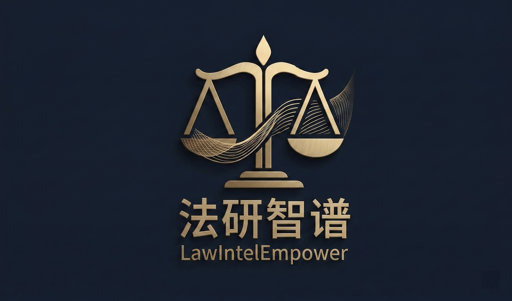
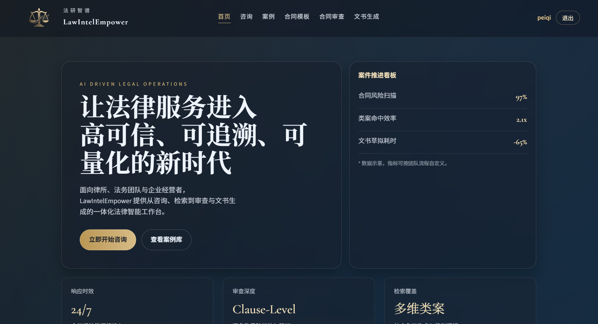
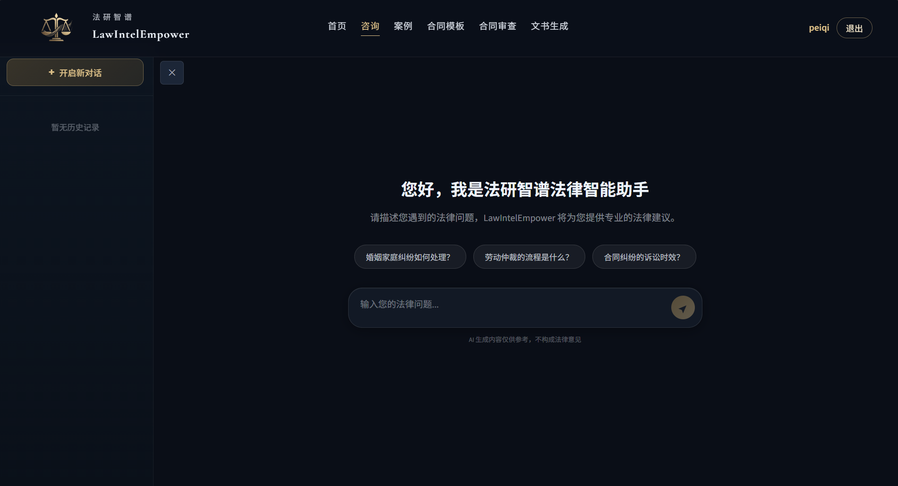
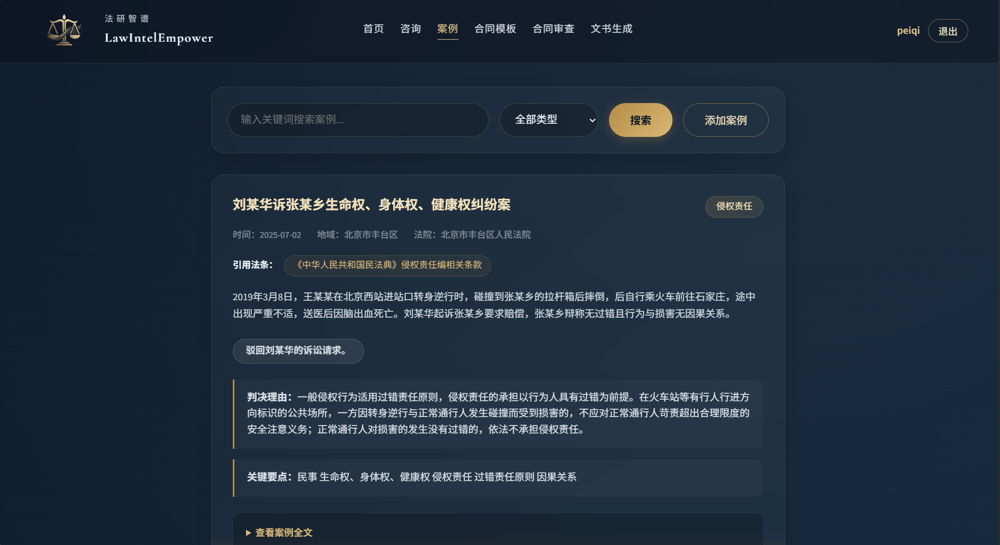
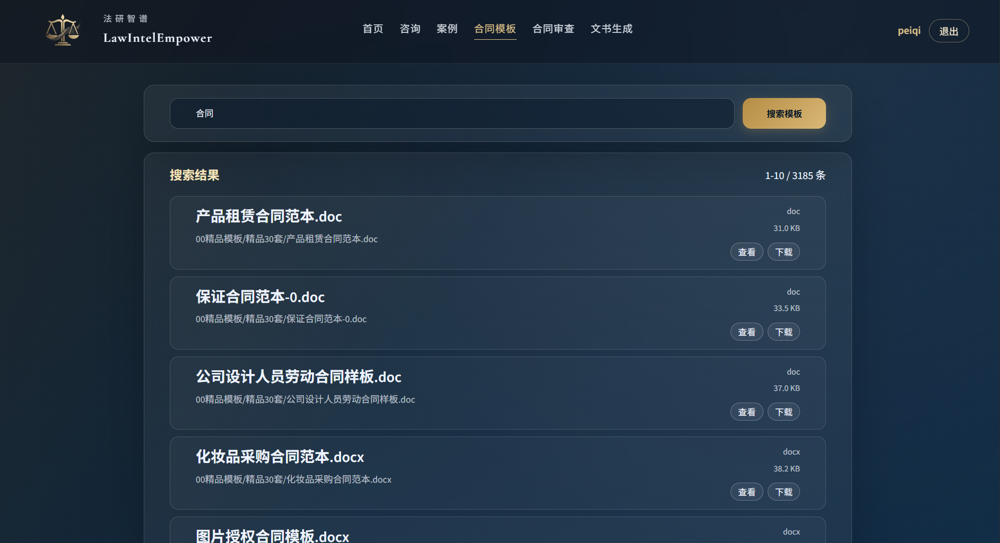
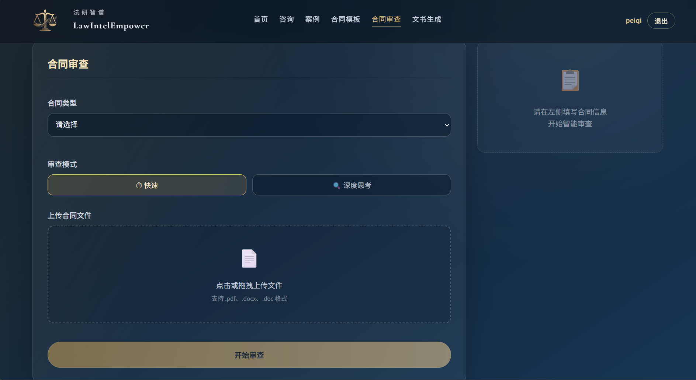
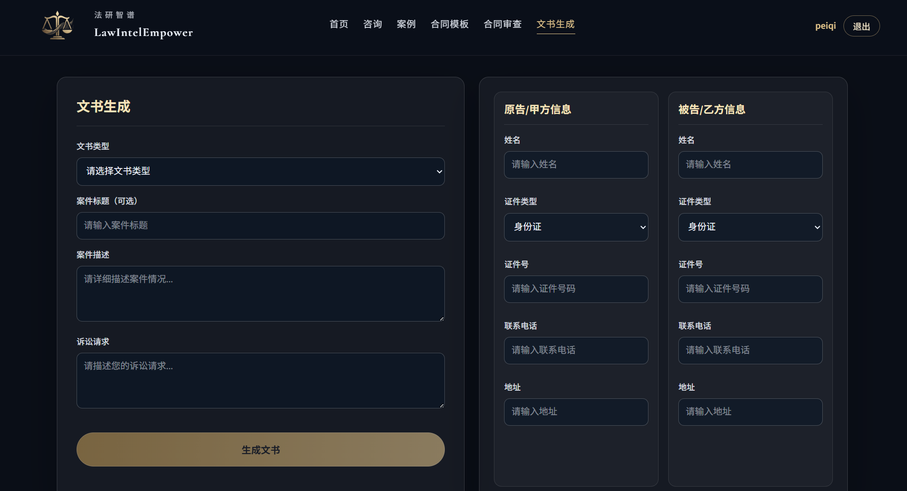

<div align="center">



<h1>
  <span style="font-size: 2.4em; background: linear-gradient(135deg, #42B883, #347a5a); -webkit-background-clip: text; -webkit-text-fill-color: transparent;">LexAI</span>
  <span style="font-size: 0.7em; color: #888; font-weight: 400;">Intelligent Legal AI Platform</span>
</h1>

<p style="font-size: 1.1em; color: #c9d1d9;">
  Built with <strong style="color:#42B883">Spring Boot</strong> +
  <strong style="color:#42B883">Vue 3</strong> +
  <strong style="color:#4479A1">MySQL</strong>, powered by
  <strong style="color:#FF6C2C">Tencent Hunyuan LLM</strong>
</p>

<p>
  
  
  
  
  
</p>

<p>
  🌐 <strong>Live:</strong><a href="http://58.87.89.131/" target="_blank">http://58.87.89.131/</a>
</p>

<p>
  <a href="#-why-choose-us">💡 Why Choose Us</a>
  ·
  <a href="#-quick-start">🚀 Quick Start</a>
  ·
  <a href="#-features">✨ Features</a>
  ·
  <a href="#-screenshots">📸 Screenshots</a>
  ·
  <a href="#-architecture">🛠️ Architecture</a>
  ·
  <a href="#-project-structure">📂 Structure</a>
  ·
  <a href="#-faq">❓ FAQ</a>
  ·
  <a href="README.md">🇨🇳 简体中文</a>
</p>

</div>

---

## 💡 Why Choose Us

<div align="center">

| | |
|:---:|:---:|
| ⚡ **Free & Barrier-Free** | No registration required. Visit http://58.87.89.131/ and use all features instantly — zero cost |
| 🤖 **LLM-Powered** | Powered by Tencent Hunyuan (Hunyuan-A13B-Instruct) with advanced legal semantic understanding and reasoning |
| 🔒 **Safe & Private** | Contract files are used only for AI analysis and never persistently stored — your data stays yours |
| 📱 **Access Anywhere** | Web-based app works smoothly on PC, tablet, and mobile. No download or installation needed |
| 📋 **All-in-One** | From legal consultation and case analysis to contract review and document drafting — full legal workflow covered |
| 🧩 **Simple to Use** | Conversational interface requires no legal background. Just start chatting — no complex forms or procedures |

</div>

---

## 📸 Screenshots

<div align="center">

| Home | Legal Consultation |
|:---:|:---:|
|  |  |

| Case Analysis | Contract Templates |
|:---:|:---:|
|  |  |

| Contract Review | Document Generation |
|:---:|:---:|
|  |  |

</div>

---

## ✨ Features

### ⚖️ Legal Consultation

> Describe your legal issue in plain language and get instant AI-powered answers. Covers **family law, contract disputes, labor disputes, traffic accidents, inheritance, property leasing** and more — available 24/7, no appointment needed.

| Category | Status |
|---------|---------|
| Family & Marriage | 🟢 Full |
| Contract Disputes | 🟢 Full |
| Labor Disputes | 🟢 Full |
| Traffic Accidents | 🟢 Full |
| Inheritance | 🟢 Full |
| Property Leasing | 🟢 Full |

---

### 📂 Case Analysis

> Submit a case description and the AI automatically identifies the case type, suggests litigation strategy, outlines evidence requirements, evaluates risk points, and cites legal grounds — helping you understand your case before consulting a lawyer.

---

### 📋 Contract Review

> Upload contract files (PDF / Word supported). The AI selects the appropriate review rules based on contract type. Supports **Basic Review** (fast risk identification) and **Advanced Review** (lawyer-level clause-by-clause analysis).

| Contract Type | Basic | Advanced |
|----------|:-------:|:-------:|
| Labor Contract | 🟢 | 🟢 |
| Lease Agreement | 🟢 | 🟢 |
| Purchase & Sale | 🟢 | 🟢 |
| Loan Agreement | 🟢 | 🟢 |
| Service Contract | 🟢 | 🟢 |
| Tech Contract | 🟢 | 🟢 |
| Investment Contract | 🟢 | 🟢 |

---

### 📄 Document Generation

> Based on your case facts and claims, the AI generates standard legal documents — **complaints, defense statements, appeals, asset preservation applications, enforcement applications** and more. Ready to file without tedious formatting.

---

### 📚 Contract Template Library

> Built-in local contract template repository with **full-text keyword search and category browsing**. Find the template that best fits your needs, preview and download online — significantly reducing the cost of initial contract drafting.

---

## 🛠️ Architecture

```
┌─────────────────────────────────────────────────────────┐
│                     User Browser                          │
│                 http://localhost:3000                    │
└──────────────────────────┬──────────────────────────────┘
                           │ HTTP
                           ▼
┌─────────────────────────────────────────────────────────┐
│              Vite Dev Server（Frontend）                 │
│          localhost:3000 → Proxy /api/*                 │
└──────────────────────────┬──────────────────────────────┘
                           │ /api → :8089
                           ▼
┌─────────────────────────────────────────────────────────┐
│             Spring Boot（Backend） localhost:8089        │
│  ┌─────────────────────────────────────────────────┐   │
│  │  Controllers → Services → Repositories           │   │
│  │  Security（JWT Filter）                          │   │
│  │  AiService（SiliconFlow AI Scheduling）          │   │
│  └─────────────────────────────────────────────────┘   │
│              ↓                        ↓                  │
│  ┌───────────────┐       ┌────────────────────────┐    │
│  │  MySQL :3306  │       │ SiliconFlow API（Web）│    │
│  │    lexai_db   │       │  Hunyuan a13b Model  │    │
│  └───────────────┘       └────────────────────────┘    │
└─────────────────────────────────────────────────────────┘
```

### Tech Stack

| Layer | Technology |
|------|----------|
| 🖥️ **Frontend** | Vue 3.4 + TypeScript 6.0 + Vite 5.0 |
| 📦 **State** | Pinia 2.1（JWT Auth State） |
| 🧭 **Router** | Vue Router 4.2（Route Guards） |
| 🌐 **HTTP** | Axios 1.6（Auto Token Injection） |
| ⚙️ **Backend** | Spring Boot 3.2 + Java 17 |
| 🔐 **Security** | Spring Security + JWT（jjwt 0.12.3） |
| 💾 **Persistence** | Spring Data JPA + MySQL 8.0 |
| 🤖 **AI** | SiliconFlow API（Tencent Hunyuan-a13b-instruct） |
| 📄 **Parsing** | Apache Tika 2.9.2 |
| 📖 **API Docs** | SpringDoc OpenAPI 2.3.0（Swagger UI） |

---

## 🚀 Quick Start

### Requirements

| Tool | Version |
|------|---------|
| 🟠 JDK | 17+ |
| 🟢 Node.js | 18+ |
| 🔵 MySQL | 8.0+ |
| 🌐 Git | Latest |

### 1. Initialize Database

```bash
mysql -u root -p < database/schema.sql
```

### 2. Start Backend

```bash
cd backend

# Set environment variables
export SILICONFLOW_API_KEY=your-api-key
export JWT_SECRET=your-256-bit-secret

# Run
mvn spring-boot:run
```

> Or modify default values in `backend/src/main/resources/application.yml`.

### 3. Start Frontend

```bash
cd frontend
npm install
npm run dev
```

### 4. Access

| Service | URL | Note |
|------|------|------|
| 🌐 Live Platform | http://58.87.89.131/ | Access online without local deployment |
| 🌐 Frontend | http://localhost:3000 | Register/login to use all features |
| 🔌 Backend API | http://localhost:8089 | RESTful API root |
| 📖 Swagger Docs | http://localhost:8089/swagger-ui.html | API documentation |

---

## 📂 Project Structure

```
lexai/
├── backend/                          # Spring Boot Backend
│   └── src/main/java/com/lexai/
│       ├── config/                   # CORS / Security / Swagger / SiliconFlow
│       ├── controller/               # Controllers
│       │   ├── AuthController        # Auth（Register / Login）
│       │   ├── ConsultationController # Legal Consultation
│       │   ├── CaseController         # Case Analysis
│       │   ├── ContractController     # Contract Review
│       │   ├── DocumentController    # Document Generation
│       │   └── TemplateSearchController # Template Search
│       ├── service/                  # Business Logic
│       │   └── AiService             # AI Scheduling Center
│       ├── repository/              # JPA Repositories
│       ├── entity/                  # Entity Classes
│       ├── dto/                    # Data Transfer Objects
│       ├── security/               # JWT Authentication
│       └── common/                 # Common Response
│
├── frontend/                         # Vue 3 Frontend
│   └── src/
│       ├── views/                   # Page Components
│       ├── components/             # Shared Components
│       ├── stores/                 # Pinia Stores
│       ├── router/                 # Router Config
│       └── api/                   # Axios Wrapper
│
└── database/
    └── schema.sql                   # Database Schema
```

---

## ⚙️ Configuration

`backend/src/main/resources/application.yml`

```yaml
server:
  port: 8089

spring:
  datasource:
    url: jdbc:mysql://localhost:3306/lexai_db
    username: root
    password: 123456
  jpa:
    hibernate:
      ddl-auto: update

siliconflow:
  api:
    key: your-api-key
    base-url: https://api.siliconflow.cn/v1
  model: tencent/hunyuan-a13b-instruct

jwt:
  secret: your-256-bit-secret
  expiration: 86400000   # 24 hours

template:
  search:
    root-dir: ../合同协议模板
    max-results: 100000
```

---

## 🔐 Authentication

- **Public endpoints**：`/api/auth/**` (auth), `/api/template/**` (templates) — no auth required
- **Protected endpoints**：All other endpoints require `Authorization: Bearer <token>` in request header
- JWT is stored in localStorage, Axios interceptor injects it automatically

---

## ❓ FAQ

<details>
<summary><strong>Do I need an API Key?</strong></summary>

Yes. You need to apply for an API Key at [SiliconFlow](https://www.siliconflow.cn) to use AI features.
</details>

<details>
<summary><strong>Do I need to create database tables manually?</strong></summary>

No. JPA is configured with `ddl-auto: update`, which automatically creates tables on startup. You can also run `database/schema.sql` manually.
</details>

<details>
<summary><strong>No preset account — what to do?</strong></summary>

There are no preset accounts. Please register at http://58.87.89.131/register to create your first account.
</details>

<details>
<summary><strong>Do I need to restart after frontend changes?</strong></summary>

No. Vite supports Hot Module Replacement (HMR) — changes are reflected in the browser automatically.
</details>

---

<div align="center">


**Making legal services accessible to everyone.**

Unauthorized copying, modification or building is prohibited.

</div>
